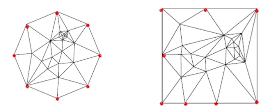
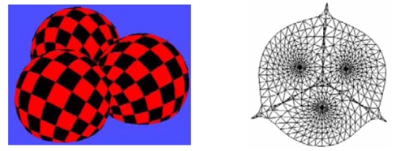
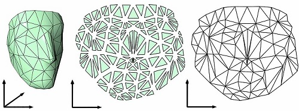
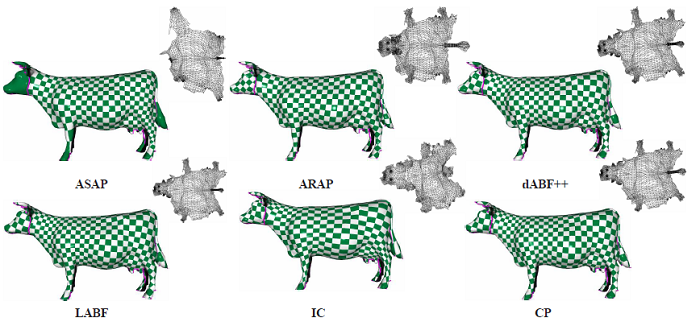
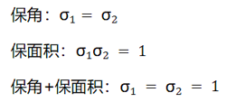

网格参数化 
=================
###### 2021.09.08

## 理论基础
参数化：对于拓扑相似的任意两个曲面，它们之间存在一个双射映射。  
网格参数化：如果上述曲面之一是一个三角形网格。  
平面网格参数化：参数化的目标曲面是一个 [0, 1] * [0, 1] 的二维平面。  
网格参数化目标：1. 减少扭曲（distortion）；2. 没有重叠（intersection）；3. 避免翻转（flip）

## 输入输出
输入：三角网格  
输出：网格顶点对应的UV坐标

## 算法
除了直接映射到基准面上，可以分成3个大类：  
1. Tutte's embedding method 和该方法的拓展
2. Geometry-based optimization method
3. Foldover free guaranteed optimization method

#### Meshlab Flat Plane（拍到平面上） 
1. 选一个投影基准面（通常选择xy、xz、yz平面）
2. 把网格/面投影到基准面上，求uv（未归一化）
3. 求投影后的包围盒，最大Width、Height
4. 归一化uv

#### Tutte's embedding method
针对开曲面网格，顶点映射到固定边界，解稀疏方程  
  
优点：不会发生翻转  
缺点：扭曲很大（考虑到项目模型也是开曲面，同时比较规整，可以试一下）

#### Geometry-based optimization method
##### Angle Based Fattening (ABF)
保角，把角度当做变量，求解相似三角形  
  

##### ARAP
1. 三角网格离散化（保证每个三角的刚性）
2. 把每个三角形“拼接”到二维平面上（寻找最优的旋转角度）  
  

##### ARAP的拓展：Local/global
local：每个三角形  
global：整个UV二维平面  
ARAP针对网格顶点和顶点邻居  
Local/global针对三角网格  
  

#### Foldover free guaranteed optimization method
##### Flip-free parameterization method
基于Tutte's embedding method，迭代调整顶点，使得扭曲逐渐减小  

度量扭曲的方法：  
对称的 Dirichlet 能量：  
  
近年研究方向：  
快速求解最小扭曲能量方程：  
    
最近提出的解决方案：  
L-BFGS、AQP、SLIM、AKVF、CM

## 参数化质量分析
三角网格内接圆旋转扭曲过程：  
  
对于模型上的一个三角网格，先做旋转 R，然后做扭曲  
   
对上式的 L 做 SVD 奇异值分解：  
  
保角保面积：  
    

