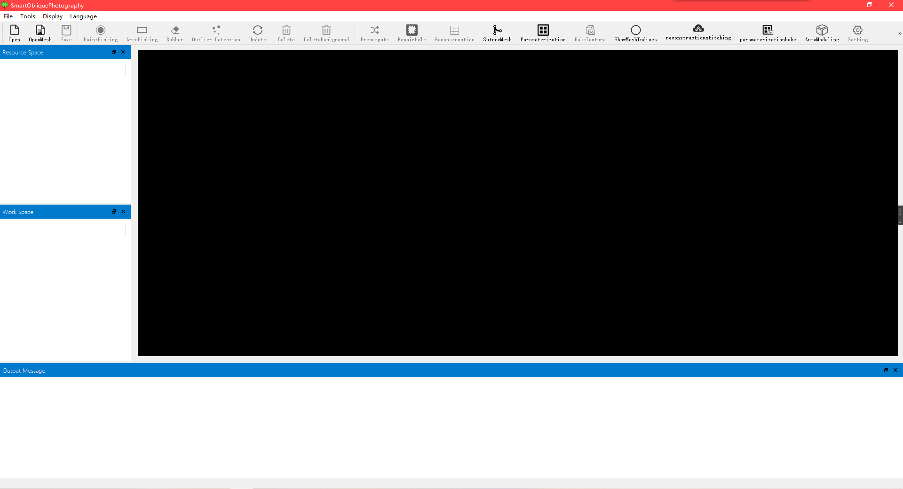
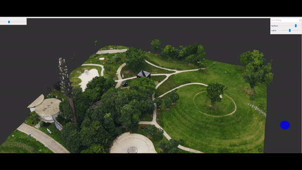
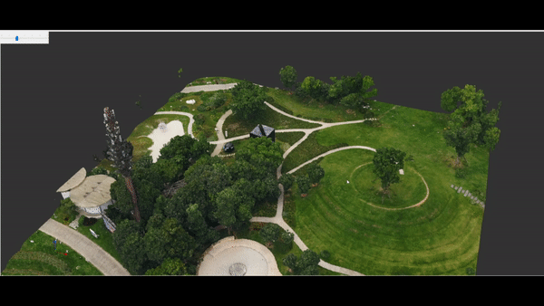
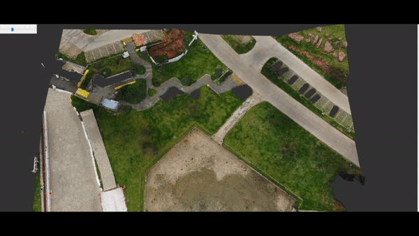
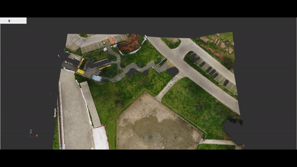
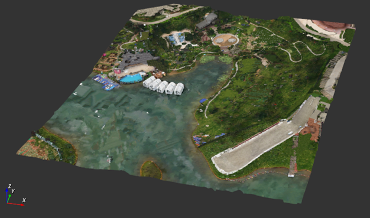
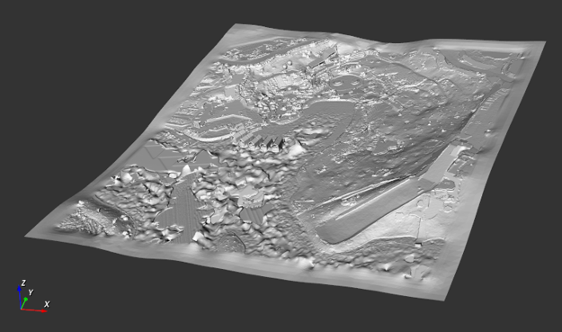
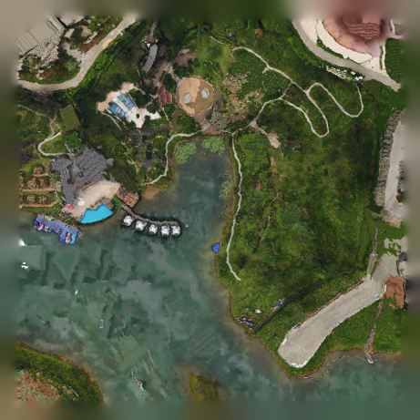

# Smart Oblique Photography
Smart Oblique Photography 是一个基于 PCL 点云库和 Qt 界面的倾斜摄影地形块交互编辑系统。

## Background
倾斜摄影是一种通过无人机航拍获得大量图像数据，根据CV算法重建LOD模型网格和纹理的**中模快速建模**方式。但其缺点也比较明显：
1. 模型及贴图质量高但信息量一般，即网格面数和纹理分辨率巨大，但复杂度不一定高，直接用很亏。 &emsp;
    需要经过**简化**保留细节同时减少大量低频面片及纹素。
2. 模型网格不具有单体意义，难以进行后续编辑，贴图仅光照贴图且组织琐碎，难以直接放入游戏引擎。 &emsp;
    需要对模型实现**提取和分离**，需要对贴图进行重新组织。
3. 因为基于图像，会由于路线，遮挡，运动等问题导致匹配失败在局部产生问题网格，要对模型进行修复。 &emsp;
    需要**删除**部分模型，但直接删除会导致模型出现空洞部分。

## Demand
智慧城市相关应用的需求是**尽量真实复刻**现实世界，但因为技术力和成本等问题，美工通常手动对整座城市进行建模，效率低下而且不利于后续发展，而通过倾斜摄影技术能轻松获得真实比例的LOD模型，但其缺点如上，所以可以考虑使用部分航拍模型结合手工建模。对于精度较高的建筑仍手动精细建模，而精度要求不高但比例要求较高的**地形**则通过倾斜摄影模型获取。

## Solution
&emsp;&emsp;我们发现地形的几何质量要求不高，但需要很高的纹理质量。在对网格编辑时未必需要同时考虑纹理信息，并且对于网格的操作比较繁琐，需要考虑各种拓扑关系，所以尝试将几何和纹理信息解耦。 
&emsp;&emsp;在进入编辑前先在网格模型上每面片根据泊松盘采样获得一定密度的**模型点云**，后面的提取，分离，删除等操作都对点云进行处理，能加快开发速度和运行效率。 
&emsp;&emsp;而对于没有显式指定模型意义的点集，我们发现有意义的整体往往在空间上相邻(例如汽车外壳和其车轮)，且其宏观上满足一些特征。所以其提取和分离我们通过**区域生长**算法，引入**颜色复杂度**，**法线复杂度**，**平面度**等特征，从用户选取的部分点开始，快速扩展到相似的点集，该部分通过场景八叉树加速位置查询。 
&emsp;&emsp;同时对于算法少选或误选的部分点，我们使用**离群点检测**和去除算法来保证选取的有效性。 
&emsp;&emsp;但因为倾斜摄影模型只有最近表面信息，编辑删除部分杂物后将会产生空洞，为了简易填补模型空洞，我们通过顺序无关的**样式纹理合成**结合凹凸贴图思想，来生成纹理点云填补空洞。 
&emsp;&emsp;在保留需要的部分，删除无意义部分后，就需要重建模型几何和纹理还原为网格加贴图。 
&emsp;&emsp;通过**泊松网格重建**可以将点云重建回网格模型，但重建结果往往包含很多低频面片，我们使用**边坍塌网格简化**算法保留细节降低面数，并**去除非流形**点及面清理模型为后面计算做准备。 
&emsp;&emsp;此时的网格模型没有纹理坐标，再通过**图特矩阵网格参数化**，将网格面片无重叠且尽量小扭曲地投影到UV空间来获得纹理坐标(展UV)，最后通过**光线投射烘焙纹理**，采样原有模型的光照贴图到当前模型纹理空间，最终获得了有意义且可编辑的地形模型。 
&emsp;&emsp;因为地形块通过规定坐标范围划分，部分模型会跨越地形块，编辑后可能存在地块接缝对端问题，我们通过**网格缝合**算法来将分隔平面两边未对端的网格重新拓扑分配面片，得到了无接缝的多地形块。 
&emsp;&emsp;后续可以通过附上法线贴图和置换贴图来丰富地形细节，暂未实现的有：1. 光照贴图去光照(Delighting)得到更有意义的材质。2. 粗糙建筑的程序化生成。3. 更有效的批处理算法。 

## Modules
### ObliquePhotographyData 数据读写模块

### Visualizer 显示模块

### PointCloudRetouch 交互编辑模块

### SceneReconstruction 场景重建模块

### Qt 界面应用
  

## Examples
### 使用界面

### 交互选取
  
  

### 空洞填补
  
  

### 网格参数化
  
  
  

### 网格缝合

### 编辑结果
